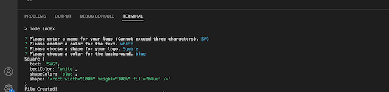
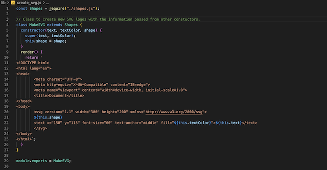
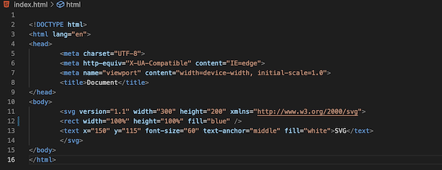
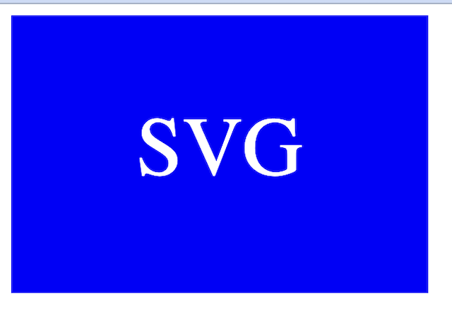

# SVG-Logo_Generator

  

  ## Description:
        
  A Node.js project to quickly create a simple SVG logo with up to three characters and three different background shapes.
    
  ---
  
  ## Table of Contents:
    
  - [Instillation](#instillation)
  - [Usage](#usage)
  - [Credits](#credits)
  - [License](#license)
  - [Questions](#questions)
  
  ## Instillation:
  
  For instillation, please clone down from the repo to a local file on your machine. Once you have opened your cloned version with a tool such as VS Code, open inded.js file in a terminal an run the command (npm i). This will install all of the dependencies for the tool to work. Once that is complete, You can start the tool by typing in (npm start) and answer the questions that follow in the terminal to create a new SVG logo.
  
  ## Usage:
  
  A good use case for this tool would be if you wanted to quickly make a place holder logo for a project you are working on to speed up your development process.
  
  ## ScreenShots:
  

  ---

  
  
  ---

  
  
  ---

  
  
  ## Credits:
  
  Third-party Resources: 
  - [Jest](https://jestjs.io/)
  - [Inquirer](https://www.npmjs.com/package/inquirer)
  - [Node.js](https://nodejs.org/en)
  

  

  
  
  
  
  ## License:
  
  This project uses the [MIT](https://opensource.org/licenses/MIT) license.

  ## Tests:

  This project used "Jest" as a dev dependancy. There are three seperate test files that verify if the shape and color are assigned to the new logo match the users input. If you would like to run the tests your self, please use the command (npm test).

  ---
  
  ## Questions:

  Please feel free to get in contact if you have any questions about this project.

  - Github: [Jamesgit22](https://github.com/Jamesgit22)
  - Email: jamesschroedermail97@gmail.com